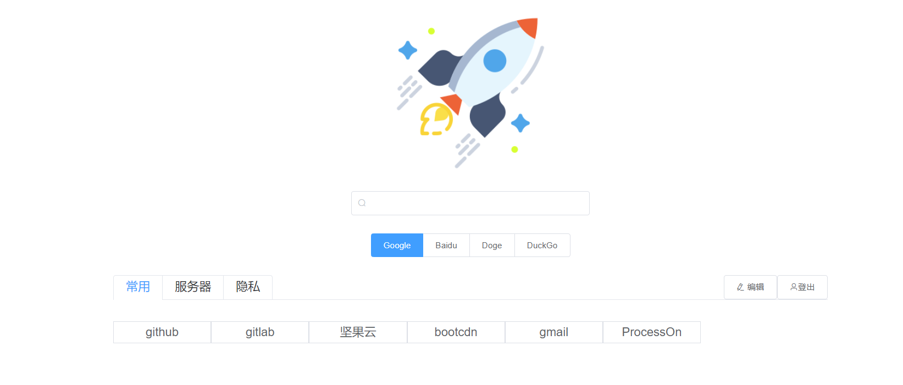
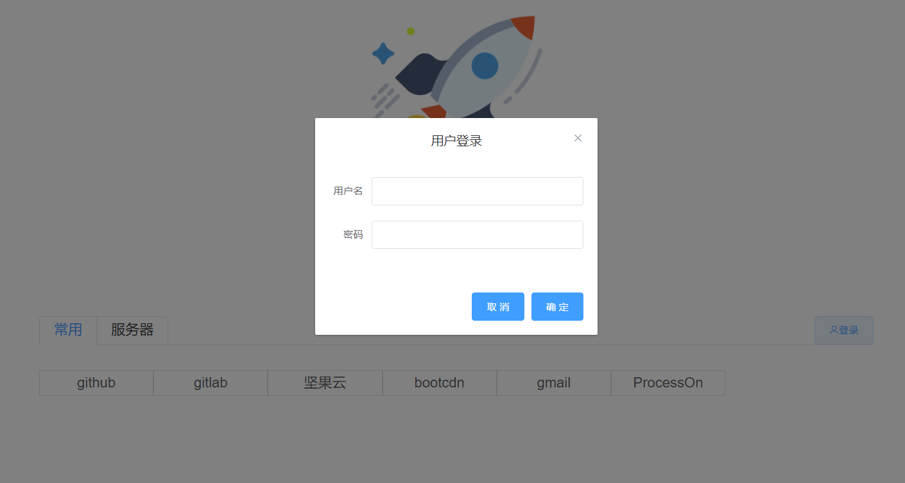
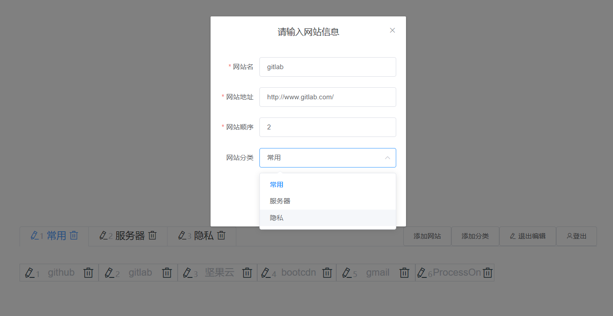
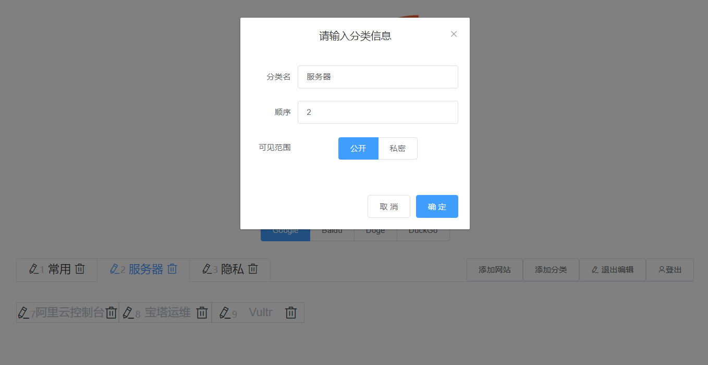
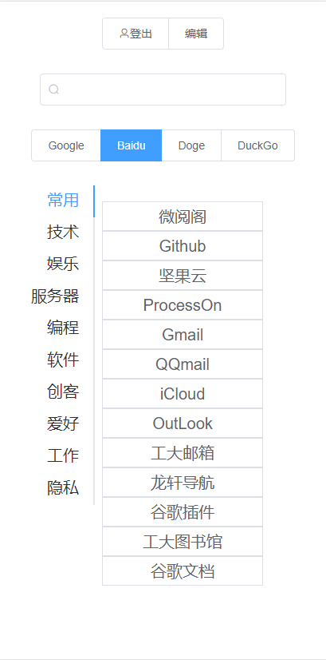

# QUIK导航

一个使用 Vue + SpringBoot 搭建的个人导航网站。

## Demo

demo地址:
http://test.fangshirui.cn

管理员账户密码： admin 123456 (请不要删除原始分类！)

上线自用版：
https://nav.fangshirui.cn

管理员账户密码：🙄🙄🙄

## 背景

随着在互联网冲浪~~划水~~的时间越来越长，我的书签也越来越多，书签的管理成为我的刚需。

传统的书签方案要么是本机储存，要么是云服务储存。本机储存的不能满足随时随地的要求。储存在Google账户中本是一个不错的选择，奈何，国内的环境访问Google过于费劲。

如果有一个随时随地都能响应我需求的导航网站就再好不过了，功夫不负有心人，几年前，我发现了龙轩导航这个宝藏网站。

大约是去年，龙轩导航改版了，新版的风格我委实喜欢不来:innocent:，虽然可以切换为旧版，但这种受制于人让我感觉很不安全。而且龙轩导航也至少需要一次登陆才可以访问到自定义网站。我又在网上疯狂寻找能代替龙轩导航的，或者是什么类似的开源项目。但最终一无所获。独立写一个导航网站势在必行:cry:。

于是QUIK导航诞生了。

##  功能

它的特色功能包括

* 不登录访问自定义网站

    

* 登录

    

* 即时快速修改

    

* 调整顺序与分类转移

    

* 隐藏分类(登录可见)

    

* 状态记忆（无论是否登陆，都会保存状态到localStorage）

    

* 移动端适配

    

## 使用

此仓库是项目的后端组成部分。

1. 在数据库中建表，在仓库根目录下有三个sql文件，可以帮助快速建表。字段名及表名不能修改。	
2. 修改springboot中的application.yml，配置自己数据库的连接信息
3. run!

## 技术栈

* SpringBoot
* JWT
* MyBatis
* MySQL

## License

MIT

欢迎fork，求个Star🤗

1

